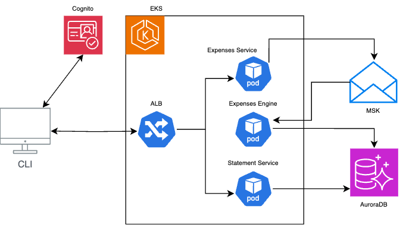

# Architecture Design (2nd part)

This architecture description does not resemble the app develop. It describes what/how I think would be a good design to
be resilient and scalable.

## Design

A brief design of the components and their interactions:

### Components

- CLI: any client application to access the services
- Cognito: AWS service to provide users authentication and authorization
- MSK: AWS Kafka service
- AuroraDB: AWS Postgres database
- EKS: AWS Kubernetes service
    - ALB: Ingress load balancer to expose services
    - Expenses Service: Responsible for receiving Transactions and persisting them in Kafka
    - Expenses Engine: Responsible for Transactions consolidation to Statements (final Balances and Transactions
      reduction)
    - Statement Service: Responsible for being the query service to retrieve processed Statements

### Interactions

1. A client must authenticate and be authorized to add Transactions on behalf of its group
2. The Transactions are received via HTTP at the Expenses Service, which then can:
    1. Run needed validations
    2. Send Transactions to Kafka
    3. Return to the user a successful or error response
3. The Expenses Engine should:
    1. Persist in the database every transaction received
    2. Run a scheduler to periodically process received Balances and persist their results in the database
4. The Statement Service:
    1. Would simply fetch processed results from the database to return them to clients via HTTP as requested
